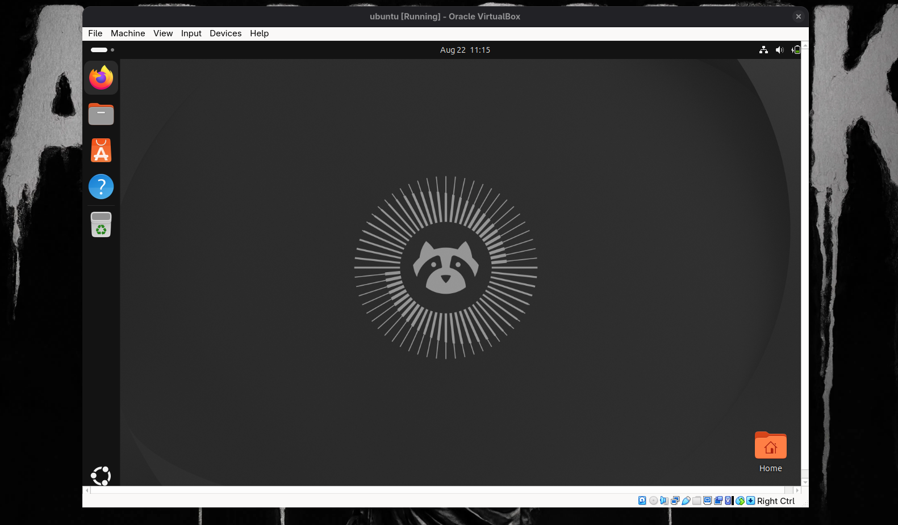

# Ubuntu VM in VirtualBox

A screenshot of an Ubuntu desktop running as a virtual machine inside Oracle VirtualBox.

## Overview

| Item | Detail |
|---|---|
| Hypervisor | Oracle VirtualBox |
| VM name | `ubuntu` |
| VM state | Running |
| Guest OS | Ubuntu (GNOME desktop) |
| Guest clock | Aug 22, 11:15 |
| Host key | Right Ctrl |

The wallpaper shows a raccoon mascot, which points to the Ubuntu "Resolute Raccoon" release (26.04).

## VirtualBox Window

- **Title bar:** `ubuntu [Running] - Oracle VirtualBox`
- **Menu bar:** File, Machine, View, Input, Devices, Help
- **Status bar (bottom):** device indicators (storage, optical drive, USB, network, shared folders, display, and so on) and the **Right Ctrl** host key label

## Ubuntu Desktop

### Top bar

- Activities indicator (top-left)
- Date and time in the center: `Aug 22 11:15`
- System tray (top-right): network, volume, and battery/power icons

### Dock (left side)

| Order | App | Purpose |
|---|---|---|
| 1 | Firefox | Web browser |
| 2 | Files | File manager |
| 3 | App Center | Install and manage software |
| 4 | Help | Ubuntu documentation |
| 5 | Trash | Deleted files |
| Bottom | Show Applications | Opens the app grid |

### Desktop

- **Home** folder icon in the bottom-right corner
- Dark wallpaper with a radial raccoon emblem in the center

## Tips for Working in the VM

- Press **Right Ctrl** to release the mouse and keyboard from the VM back to the host.
- Install **Guest Additions** (Devices → Insert Guest Additions CD image) for better resolution, shared clipboard, and drag and drop.
- Use **Devices → Shared Folders** to exchange files with the host.
- Take a **snapshot** (Machine → Take Snapshot) before making major changes.

## Notes

- The VM is running with a fresh default desktop: no windows are open and only the default dock apps are pinned.
- The window is not maximized, so the host wallpaper is visible around it.
